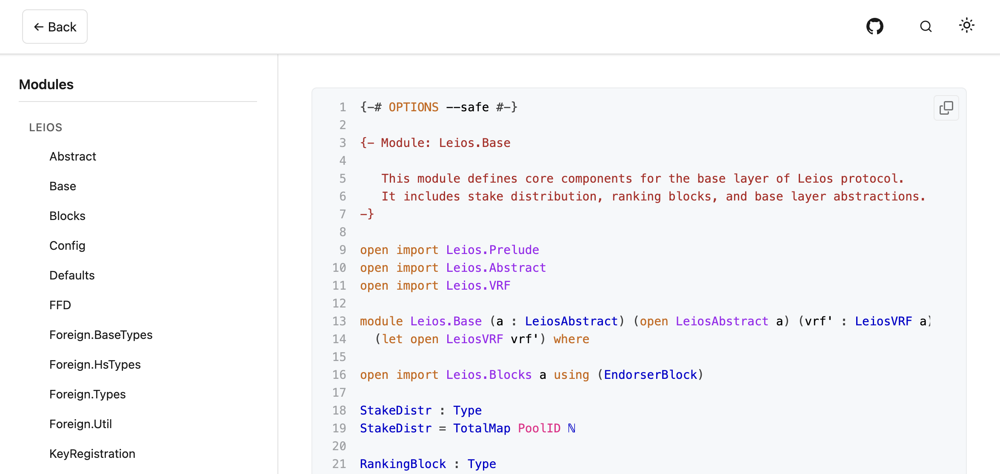
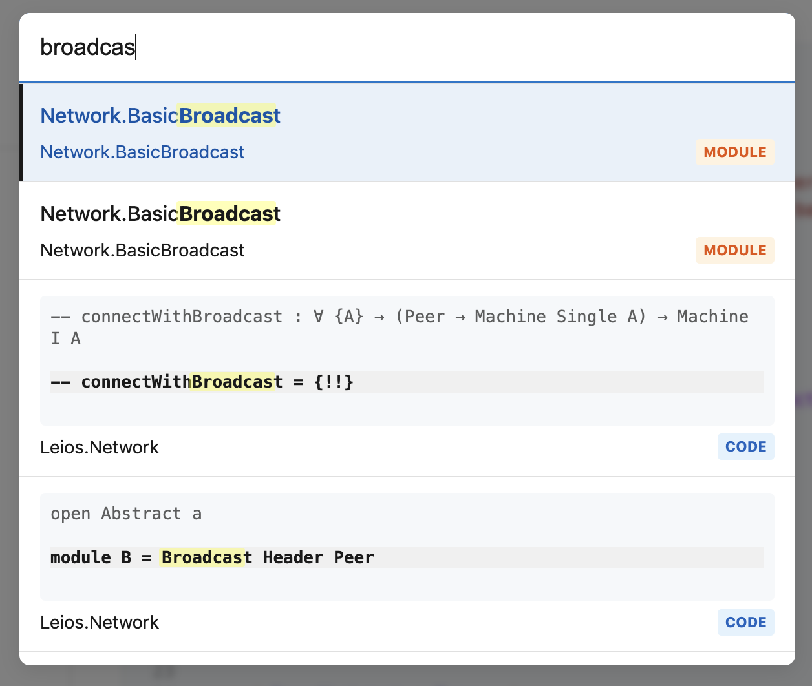
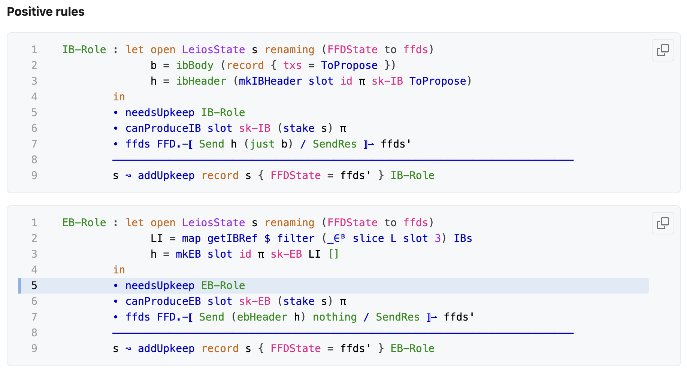
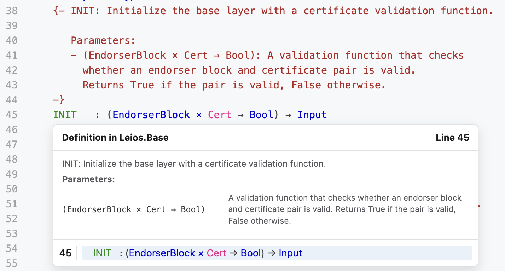

# Agda Web Docs Library

[](https://github.com/will-break-it/agda-web-docs-lib/actions/workflows/ci.yml)
[](https://badge.fury.io/js/agda-web-docs-lib)
[](https://opensource.org/licenses/MIT)

Transform your Agda HTML documentation with modern web features, responsive design, and powerful search capabilities.

## ✨ Features

- 🎨 **Clean, responsive design** with sidebar navigation
- 🌓 **Dark/light theme** with system preference detection  
- 🔍 **Full-text search** with `Ctrl+K` / `Cmd+K` shortcut
- 🖱️ **Line highlighting** with shareable URLs (`#L42`, `#L42-L48`)
- 💡 **Type previews** on hover with cross-file resolution
- 🔗 **GitHub integration** for source file links
- 📱 **Mobile-friendly** responsive layout

## 🎯 Quick Start

### GitHub Actions (Recommended)

```yaml
- name: 🔄 Transform Agda documentation  
  uses: will-break-it/agda-web-docs-lib@v1
  with:
    input-dir: 'html/'
    github-url: 'https://github.com/your-user/your-project'
    modules: 'Your.Module.Prefix'
    cache-dependency-path: 'package-lock.json'  # Optional: enable npm caching
```

**Performance Tip:** Include `cache-dependency-path` to enable npm caching and speed up your workflows.

### CLI

```bash
npm install agda-web-docs-lib

# Process with default config
npx agda-docs process

# Custom configuration
npx agda-docs process -c config.json -i input/ -o output/
```

## 🖼️ Visual Examples

### Modern Layout & Navigation


Clean, responsive design with intelligent sidebar navigation, theme switching, and GitHub integration.

### Powerful Search


Instant search across modules, functions, and code blocks with fuzzy matching and keyboard navigation.

### Line Highlighting


GitHub-like line selection with shareable URLs. Click line numbers or select ranges with Shift+click.

### Type Previews


Rich type definition previews with documentation, parameter tables, and cross-file resolution.

## ⚙️ Configuration

Create `agda-docs.config.json`:

```json
{
  "backButtonUrl": "/",
  "modules": ["Your.Module.Prefix"],
  "githubUrl": "https://github.com/your-user/your-project"
}
```

## 🛠️ Advanced Usage

### Complete GitHub Workflow

```yaml
name: Deploy Agda Documentation

on:
  push:
    branches: [main]

jobs:
  generate-docs:
    runs-on: ubuntu-latest
    steps:
      - uses: actions/checkout@v4
      
      - name: Setup Agda
        uses: wenkokke/setup-agda@v2
        with:
          agda-version: '2.6.4'
          
      - name: Generate HTML
        run: agda --html --html-dir=html/ src/Main.agda
        
      - name: Transform documentation
        uses: will-break-it/agda-web-docs-lib@v1
        with:
          input-dir: 'html/'
          github-url: ${{ github.server_url }}/${{ github.repository }}
          modules: 'Your.Module.Prefix'
    cache-dependency-path: 'package-lock.json'  # Optional: enable npm caching
          
      - name: Deploy to GitHub Pages
        uses: peaceiris/actions-gh-pages@v3
        with:
          github_token: ${{ secrets.GITHUB_TOKEN }}
          publish_dir: html/
```

### Reusable Workflow

For more complex setups, use our reusable workflow:

```yaml
jobs:
  transform-docs:
    uses: will-break-it/agda-web-docs-lib/.github/workflows/reusable-workflow.yml@v1
    with:
      input-dir: 'html/'
      github-url: ${{ github.server_url }}/${{ github.repository }}
      modules: 'Your.Module.Prefix'
    cache-dependency-path: 'package-lock.json'  # Optional: enable npm caching
      artifact-name: 'my-agda-docs'
```

### Programmatic Usage

```typescript
import { AgdaDocsTransformer, AgdaDocsIndexer } from 'agda-web-docs-lib';

const config = {
  backButtonUrl: '/',
  modules: ['Your.Module'],
  githubUrl: 'https://github.com/your-user/your-project'
};

// Build position mappings
await AgdaDocsIndexer.buildPositionMappings('path/to/html');

// Transform files
const transformer = new AgdaDocsTransformer(config);
transformer.setContent(htmlContent, 'file.html');
const processed = transformer.transform();
```

## 📚 Examples

- [Leios Formal Specification](https://leios.cardano-scaling.org/formal-spec/Leios.Base.html)

## 🤝 Contributing

Contributions are welcome! Please feel free to submit issues and pull requests.

## 📄 License

MIT
